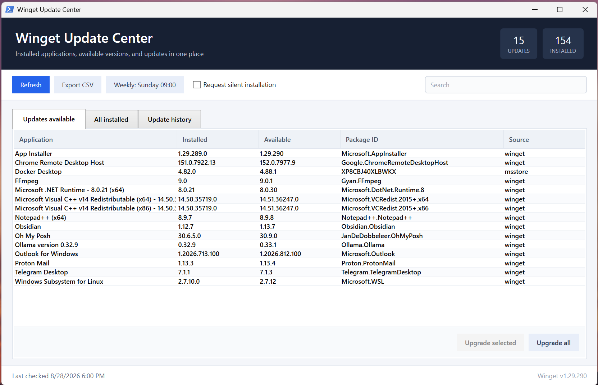

# Winget Update Center for Command Palette

Winget Update Center is a PowerToys Command Palette extension that finds applications already installed on the computer, checks which ones have updates available, and lets the user update one app or all apps through Windows Package Manager (`winget`). It also provides a single Command Palette Dock button with a flyout for reviewing, refreshing, or installing updates without opening a separate updater window.

The original PowerShell/WPF application remains in the repository as a legacy standalone interface.

> [!NOTE]
> This is a community tool and is not an official Microsoft application. It runs only on Windows and delegates package detection and installation to Winget.

## Command Palette features

- Search every application detected by `winget list`
- Show installed version, package ID, source, and available version
- Put apps with updates first and give each one an **Update** action
- Update every available package from one command
- Refresh automatically after an update completes
- Report scan and update failures directly in Command Palette
- Add a persistent icon-only Dock button with a flyout for **Review installed apps**, **Check for updates**, and **Update all**
- Show a native indeterminate progress bar while Winget is working
- Use subtle, theme-friendly status accents for checked, update-available, and up-to-date entries
- Run Winget operations in the background so the palette stays responsive

## Requirements

To run the extension:

- Windows 11
- PowerToys with Command Palette and Dock support
- App Installer / Windows Package Manager (`winget`)

To build and deploy it:

- Visual Studio 2022 or later with the WinUI application development workload
- .NET 10 SDK
- Windows 11 Developer Mode enabled

## Build and install the extension

1. Open `WingetUpdateCenter.sln` in Visual Studio.
2. Select `Debug` and the architecture matching the computer (`x64` on most PCs).
3. Select the **Winget Update Center (Package)** launch profile.
4. Choose **Build > Deploy WingetUpdateCenter.CommandPalette**. Building without deploying does not register the extension.
5. Open Command Palette and run **Reload Command Palette extensions**.
6. Search for **Winget Update Center** and open it.

The first scan starts when the page opens. Selecting an app with an available version starts its exact Winget upgrade; apps already current remain visible for inventory and search.

## Add it to the Dock

1. Open Command Palette settings and enable the Dock.
2. Enter Dock edit mode and add the **Winget Update Center** band.
3. Place the band on the desired edge or floating Dock.

The Dock shows only the custom Winget Update Center icon. Selecting it opens a compact action page whose **More actions** menu provides the full app list, a rescan, and an update-all command. The extension name remains visible in the expanded view.

## Prepare a release package

The project version is defined in `WingetUpdateCenter.CommandPalette.csproj` and must match the versions in `Package.appxmanifest` and `app.manifest`. The repository validation test checks this automatically.

Before publishing, replace the development identity values in both the project and package manifest with the exact package identity and publisher assigned by Microsoft Partner Center. Then build and test both supported architectures:

```powershell
powershell.exe -NoProfile -ExecutionPolicy Bypass -File .\tests\Test-Project.ps1
dotnet run --project .\tests\WingetUpdateCenter.CoreTests\WingetUpdateCenter.CoreTests.csproj --configuration Release
dotnet build .\WingetUpdateCenter.CommandPalette\WingetUpdateCenter.CommandPalette.csproj --configuration Release -p:Platform=x64 -p:RuntimeIdentifier=win-x64
dotnet build .\WingetUpdateCenter.CommandPalette\WingetUpdateCenter.CommandPalette.csproj --configuration Release -p:Platform=ARM64 -p:RuntimeIdentifier=win-arm64
```

Create signed MSIX packages through Visual Studio's **Package and Publish** menu or with `GenerateAppxPackageOnBuild=true` after configuring the release certificate. Do not distribute an unsigned package or commit a `.pfx` certificate. Test the installed package on each target architecture, reload Command Palette extensions, and verify the Dock icon, scan, individual update, update-all, progress, and error states before submission.

## Command Palette project structure

```text
WingetUpdateCenter.CommandPalette/
|-- Assets/                         MSIX and extension icons
|-- Commands/                       Refresh and upgrade commands
|-- Models/                         Winget inventory records
|-- Pages/                          Searchable installed-app page
|-- Properties/                     Package launch and publish profiles
|-- Services/                       Winget process runner and table parser
|-- Package.appxmanifest            COM and Command Palette registration
|-- Program.cs                      Out-of-process COM server
`-- WingetUpdateCenter.CommandPalette.csproj
```

The CLSID in `WingetUpdateCenterExtension.cs` must remain identical to both CLSID entries in `Package.appxmanifest`. `tests/Test-CommandPaletteProject.ps1` guards that registration and checks the required package assets.

## Legacy PowerShell/WPF application

The files `WingetUpdater.ps1`, `WingetCore.psm1`, and `WingetScheduledScan.ps1` provide the previous standalone UI, including history, logs, CSV export, and scheduled scans. They are not required by the Command Palette extension.

### Legacy screenshot



### Legacy features

- View every application detected by `winget list`
- See installed and available versions in separate columns
- Search by application name, package ID, or version
- Upgrade one package, several selected packages, or every available package
- Request silent installation when supported by the installer
- Export installed applications, available updates, or update history to CSV
- Record each update attempt with its previous version, target version, result, and exit code
- Write complete Winget output to a separate log when an upgrade fails
- Schedule daily or weekly update checks with Windows notifications
- Keep scans and updates responsive by running Winget work in background jobs
- Store all runtime data under the current Windows user profile

### Legacy requirements

- Windows 10 version 1809 or later, or Windows 11
- [App Installer / Windows Package Manager](https://learn.microsoft.com/windows/package-manager/winget/)
- Windows PowerShell 5.1

PowerShell 7 can run the main script directly, but the included launcher and scheduled task use the built-in Windows PowerShell 5.1 host for maximum WPF compatibility.

Confirm that Winget is installed:

```powershell
winget --version
```

If the command is unavailable, install or update **App Installer** from the Microsoft Store.

### Legacy quick start

1. Download the repository as a ZIP file and extract it, or clone it with Git.
2. Keep the PowerShell module and scripts together in the same directory.
3. Double-click `Launch-Winget-Updater.cmd`.
4. Allow the initial Winget scan to finish.

You can also launch it from a terminal:

```powershell
powershell.exe -NoProfile -STA -ExecutionPolicy Bypass -File .\WingetUpdater.ps1
```

The execution-policy option applies only to this process. It does not modify the machine or user execution-policy configuration.

### Using the legacy application

### Review available updates

The **Updates available** tab displays:

- Application name
- Installed version
- Available version
- Winget package ID
- Package source

Use the search box to filter the current tab. Select multiple packages with `Ctrl` or `Shift`.

### Install updates

- **Upgrade selected** processes the selected rows individually.
- **Upgrade all** processes every available package individually and records a result for each package.
- **Request silent installation** adds Winget's `--silent` option. Individual installers can ignore or reject this option.

Some installers require elevation or interactive input. If an update fails because of permissions, close the application and run `Launch-Winget-Updater.cmd` as Administrator.

### Review installed software

The **All installed** tab shows applications Winget can detect from package-manager registrations and Windows uninstall records. Portable programs and manually copied executables might not appear.

### Export a report

Select the relevant tab and choose **Export CSV**. The exported columns match the selected inventory or history view.

### Update history and failure logs

The **Update history** tab is loaded automatically every time the application starts. Each attempted package upgrade records:

- Date and time
- Application and package ID
- Previous version
- Target version
- Success or failure
- Winget exit code

Failed upgrades also receive a detailed text log containing the command, exit code, and Winget output.

- Double-click a failed history row to open its log in Notepad.
- Choose **Open logs** to open the complete log directory.
- **Clear history** removes history records but deliberately keeps detailed failure logs.

### Scheduled scans

Choose **Schedule scans** to configure a daily or weekly background check. The application creates a current-user Windows Scheduled Task named:

```text
Winget Update Center Scan
```

The scheduled task runs `WingetScheduledScan.ps1` in a hidden Windows PowerShell process. It checks for updates, writes the latest result, displays a Windows notification when updates are available or the scan fails, and then exits.

Scheduled scans:

- Do not remain running between checks
- Never install updates automatically
- Require the user to be signed in to display notifications
- Are configured to run when next available if the original time was missed
- Can be removed by selecting **Disabled** in the schedule dialog

Creating or changing a scheduled task can require administrator approval on managed computers.

### Persistent data

Runtime data is stored outside the repository under:

```text
%LOCALAPPDATA%\WingetUpdateCenter
```

| Path | Purpose |
| --- | --- |
| `update-history.jsonl` | Persistent update-attempt history |
| `Logs\` | Detailed logs for failed upgrades |
| `last-scan.json` | Most recent scheduled-scan result |
| `schedule.json` | Saved schedule selection |

Data is isolated per Windows user. Removing the repository does not automatically delete this data or an enabled scheduled task.

## Privacy and security

See the [Winget Update Center privacy policy](PRIVACY.md) for the Store-ready privacy statement.

- The tool does not require an online account, API key, or credential.
- It does not add telemetry or send history files to another service.
- Winget still contacts the package sources configured on the computer to retrieve package metadata and installers.
- History and logs can contain installed application names, versions, package IDs, and installer output. Review logs before sharing them publicly.
- Package installation is performed by Winget and each package's installer. Review the selected package source and publisher before installing unfamiliar software.

## Troubleshooting

### Winget was not found

Install or update **App Installer** from the Microsoft Store, open a new terminal, and verify `winget --version`.

### No applications or updates are displayed

Run these commands in a terminal to compare their output with the application:

```powershell
winget list
winget list --upgrade-available --include-unknown
```

An empty Updates tab can simply mean that no applicable updates are available.

### An update failed

Open the **Update history** tab and double-click the failed row. Common causes include:

- Administrator privileges are required
- The installer does not support silent mode
- The application is currently running
- The package source is temporarily unavailable
- The installer returned a vendor-specific error

### Scheduled scans do not run

1. Open `taskschd.msc`.
2. Find **Winget Update Center Scan** in Task Scheduler Library.
3. Review its last-run time and result.
4. Confirm that the script directory still exists.
5. Re-save the schedule from the application if the repository was moved.

### Legacy project structure

```text
.
|-- .github/
|   `-- workflows/
|       `-- test.yml
|-- docs/
|   `-- screenshots/
|       `-- winget-update-center.png
|-- tests/
|   |-- Test-Project.ps1
|   `-- Test-WingetCore.ps1
|-- Launch-Winget-Updater.cmd
|-- PSScriptAnalyzerSettings.psd1
|-- WingetCore.psm1
|-- WingetScheduledScan.ps1
|-- WingetUpdater.ps1
`-- README.md
```

| File | Purpose |
| --- | --- |
| `WingetUpdater.ps1` | WPF interface and background-job orchestration |
| `WingetCore.psm1` | Winget process runner, parser, history, logging, and schedule helpers |
| `WingetScheduledScan.ps1` | Noninteractive scheduled scan and notification entry point |
| `Launch-Winget-Updater.cmd` | Double-click launcher using Windows PowerShell 5.1 |
| `PSScriptAnalyzerSettings.psd1` | Cross-version lint policy for intentional analyzer exceptions |
| `docs/screenshots/winget-update-center.png` | Screenshot displayed on the GitHub project page |
| `tests/Test-WingetCore.ps1` | Offline parser and persistence regression tests |
| `tests/Test-Project.ps1` | Repository-wide syntax, XAML, and lint checks |

## Development and testing

The tests do not install packages, create a real scheduled task, or require Winget network access.

Run all checks with Windows PowerShell:

```powershell
powershell.exe -NoProfile -ExecutionPolicy Bypass -File .\tests\Test-Project.ps1
```

Run the C# Winget table parser regression tests with the .NET 10 SDK:

```powershell
dotnet run --project .\tests\WingetUpdateCenter.CoreTests\WingetUpdateCenter.CoreTests.csproj
```

The GitHub Actions workflow runs both suites and compile-checks the Command Palette source on `windows-latest` for pushes, pull requests, and manual workflow dispatches.

## Contributing

Issues and pull requests are welcome. Please include:

- Windows and PowerShell versions
- Winget version
- Relevant error text or exit code
- Reproduction steps

Remove personal information from exported inventories and logs before attaching them to an issue.
